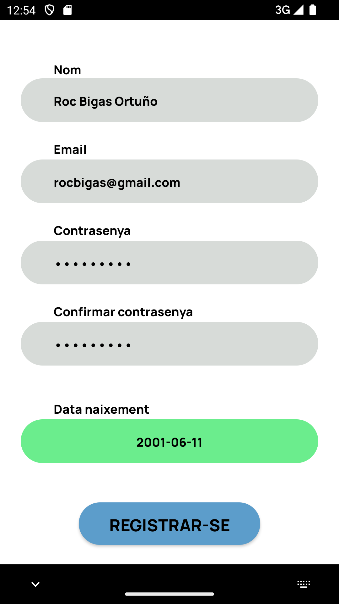
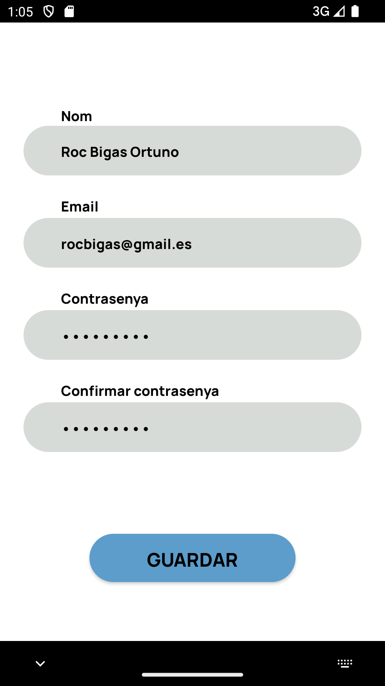

# Projecte 1 - Classync

*Roc Bigas Ortuño - DAM2B 2024/25*

# Enllaços:

+ Enllaç a la memòria: https://docs.google.com/document/d/18GxCAnsjRiH35ymbcUUmVWrCct4w0fguE2kkEBnQ9RM/edit?tab=t.0
+ Enllaç de la presentació: https://docs.google.com/presentation/d/10kQsVXWAoQsBQMQdB0HtQi5R6Cux4_z4e4irVRibcoM/edit
+ Enllaç als wireframes de Figma: https://www.figma.com/design/e9JvvtxvEOJ8tcJlP3RMJp/Projecte-1---Prototip-d-alta-fidelitat?node-id=0-1&p=f&t=IORuCwaXfrJUvkiu-0

# Vistes i funcionalitats de l'aplicació

Seguidament es mostren captures de les diferents vistes de l'aplicació i s'explica la funcionalitat de cadascuna d'elles:

## Pàgina d’inici

Aquesta vista ens mostra el logo de l’aplicació i el nom, a part de dos botons. Els botons tenen la funcionalitat de portar-nos a la vista d’inici de sessió o a la de registre. Si l’usuari ja té un compte creat escollirà el botó d’inici de sessió, i sinó seleccionarà el de registrar-se.

## Inici de sessió

Aquesta vista permet a l’usuari introduir el seu correu i la contrasenya corresponent. L’aplicació crida a l’API per comprovar les dades introduïdes. Si son correctes, redirigeix la vista a la pàgina d’inici corresponent de l’usuari. Si no son correctes, mostra un Toast indicant el motiu de l’error (camps buits, format incorrecte, credencials no coincidents…).

## Registre

La funcionalitat de registre està dividida en dues vistes, amb la finalitat de facilitar el procés d’introducció de dades. Primerament, l’usuari selecciona quin tipus de perfil vol crear. Aquesta informació s’emmagatzema internament i es mostra una altra vista amb un formulari on l’usuari indicarà les seves dades personals.

Tota la informació introduïda als camps del formulari és validada per certes normes depenent de cada camp (el DNI ha de tenir 8 dígits i una lletra, l’email ha de tenir un format vàlid, el telèfon no pot contenir lletres…). Un cop l’usuari prem el botó de registrar-se l’app el redirigeix a l'activitat d’inici de sessió.

## Homepage

Al iniciar sessió amb un usuari es mostra aquesta pàgina. Es mostren dues llistes, una de classes y una altra amb les assistències dels últims 7 dies. Depenent del tipus d'usuari, es mostraran les classes i assistències d'un alumne o d'un professor. És a dir, mostra les classes en les que participa un alumne o les classes que imparteix un professor, i mostra les assistències que té un alumne o les assistències que ha introduït un professor.

## Vista de perfil

Mitjançant el menú de navegació situat a la part inferior de la pantalla, els usuaris poden accedir a l’apartat de perfil. En aquesta vista podem veure una petita salutació amb el nom de l’usuari, la seva foto de perfil, i dos botons.

El botó d’editar perfil ens porta a la vista d’edició de perfil, mentre que el de tancar sessió esborra les dades de sessió de l'usuari actual i ens porta a la activitat d’inici de sessió.

## Edició de perfil

En aquesta activitat els usuaris poden modificar les seves dades personals. Tots els camps passen per un procés de validació que comprova que no estiguin buits i que les dades introduïdes siguin correctes (el DNI ha de tenir 8 dígits i una lletra, l’email ha de tenir un format vàlid, el telèfon no pot contenir lletres…). En prémer el botó de guardar es fan les validacions i, si no hi ha cap error, es persisteixen les dades corresponents a la base de dades.

## Llistat d'assistències

Aquesta activitat mostra un llistat de totes les assistències associades amb un usuari ordenades per data descendent. Si l'usuari és un alumne, mostra totes les assistències que els professors han associat a ell. Si és un professor, mostra totes les assistències que ha introduït a l'aplicació.

